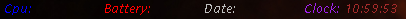
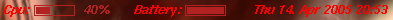

= deskbar

A lightweight, modular system monitor.
Just xlib based with optional PNG support. (Deps can vary with the plugins)

== Screenshots

== Links

- https://sourceforge.net/projects/deskbar/
- https://deskbar.sourceforge.net/
